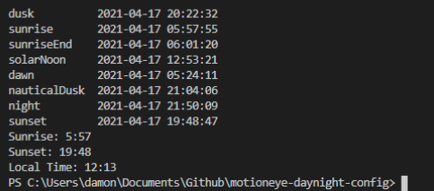
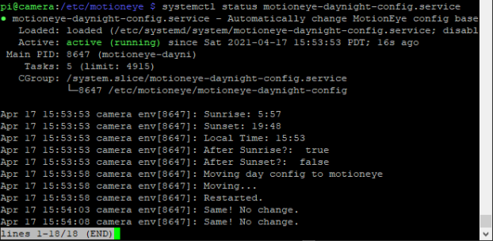
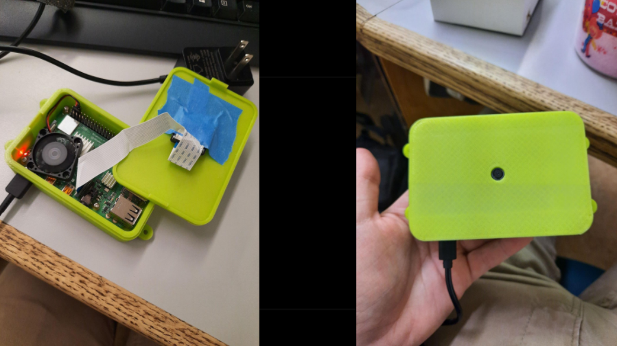
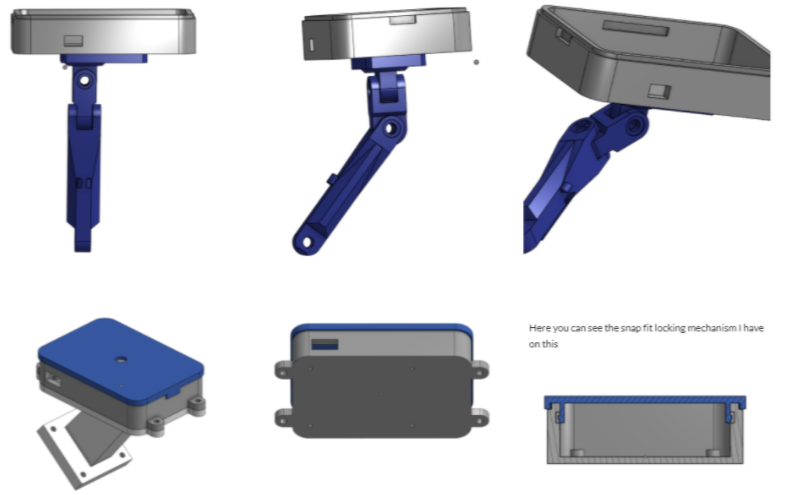
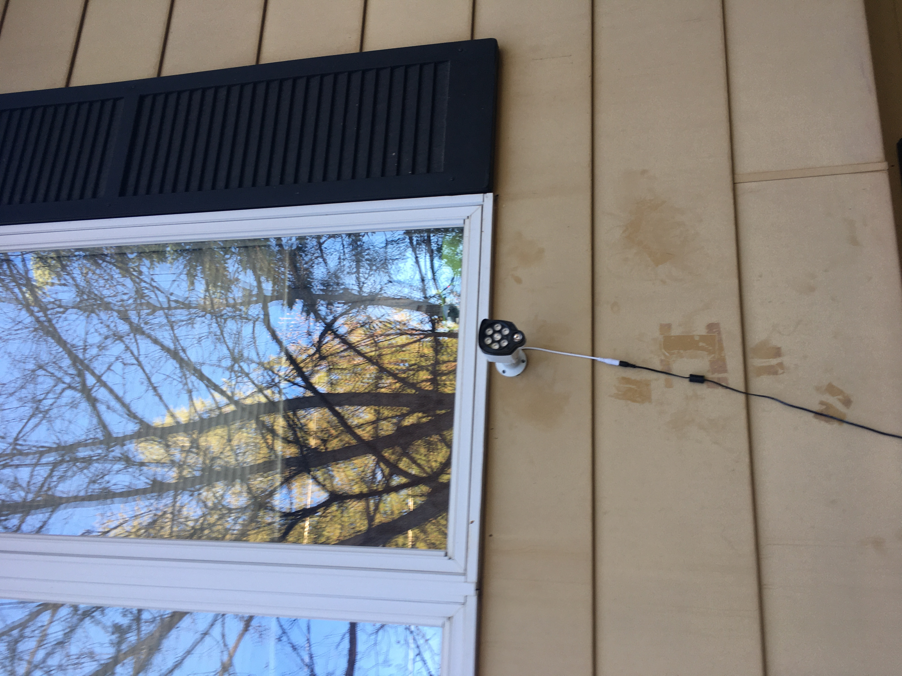
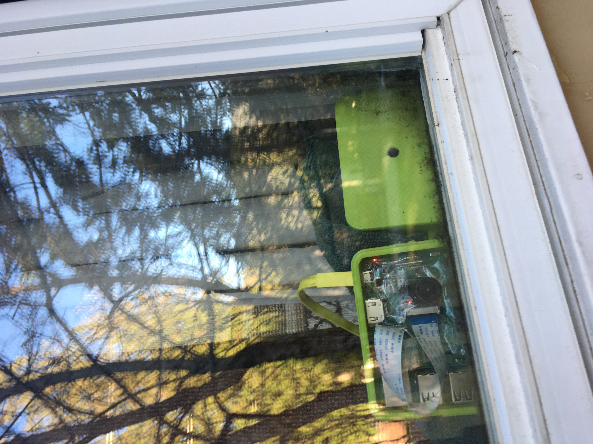
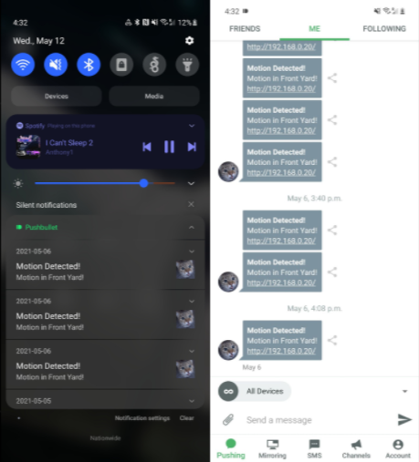

portfolio.txt

## Source VTF format modifier

When you are put on board with a new team, you get the pleasure of fixing what the people before you did. I ran into an interesting scenario where I had hundreds of VTF materials for models on a Source Engine game, but these files were using the DXT3 compression format over the DXT5 compression format, making the filesize 3x the size it should be. The images did not store any transparency so the higher bit format was unnecessary.

```
image of dxt3 vs dxt5 filesize
```
```
image of recursive folder searching and progress bar
```

## Sourcepawn CI/CD Enviornment

Having good DevOps makes developing for communitys and companies many times easier for the developers and allows increased collaboration and productivity, which is why I spent the agregious task of setting it up for my community. Using github actions, I compile each new versions of my plugin on each commit and automatically deploy the compiled plugin to my ftp server. Through bash scripts the server can automatically detect new plugin changes and reload the plugins to have seamless code to product synergy.

When a commit is stable enough for release, merging it to the master branch will run the CI/CD Github Actions and will be created as a release, the live production server will pull the release automatically and deploy it with a live reload to have no downtime on the server with players currently playing on it.


```
image of my balls
```

## Raspberry Pi Nightvision Camera

I want to preface this by saying I'm not a [creep,](https://www.youtube.com/watch?v=XFkzRNyygfk) but I have always been fascinated by watching the world happen, in the past. I love watching the wildlife on my yard, the animals that come and raid my garden at night, and the bears scavaging for berries from my bushes. I decided to kill two birds with one stone by setting up a survelience system on my house with a few Raspberry Pi's with nightvision cameras. 

With my setup, I have one node server, a Debian Server box, and two Raspberry Pi's, (3b+ and a 4,4gb) one for my front yard + driveway and one for my backyard. A significant task was learning that nightvision does not work well with high framerates! Shutter speed, limited by framerate affects the amount of light that a camera can take in and when you have nightvision, the amount of infrared light bouncing into the camera affects the ability to see at night greatly, as the world isnt lit up by a giant sun, but but a small infrared spotlight illuminator.

To remedy this, I created a small program using GoLang and a really complicated formula that I dont understand fully to get the phases of the day to swap out configuration files for MotionEye on the fly with a small downtime of 2 seconds. Unfortunately this is not the idea fix to the problem but its the best of a bad situation because to change the camera settings during recording you must relaunch the executable with new flags. I could potentially fix the issue myself and recompile the entire program myself but this is yet another rabbithole to go down.
 



I designed a cad model of the raspberry pi, and then a case around it to protect from the elements and also a mounting bracket for my house. This case is not waterproof or weatherproof for that matter but will protect it from most rain and bird shit that falls from the sky.




# Outside the house




MotionEye is a great tool and is by far the best survellience system suite that I have found as all the others are either ancient and old or not compatible with linux.


I set up a service on the Debian Server box to automatically send me push notifications on motion detection, and upload a snapshot of the past 30 seconds to cloud storage, Google Drive. There is a persistance time that works and automatically deletes files after a set time from Google Drive and my local disk. I hope to setup a timelapse of my house throughout the years which would be pretty interesting to see it evolve and wildlife grow over time.



## cool robot with flamethrower 😎

