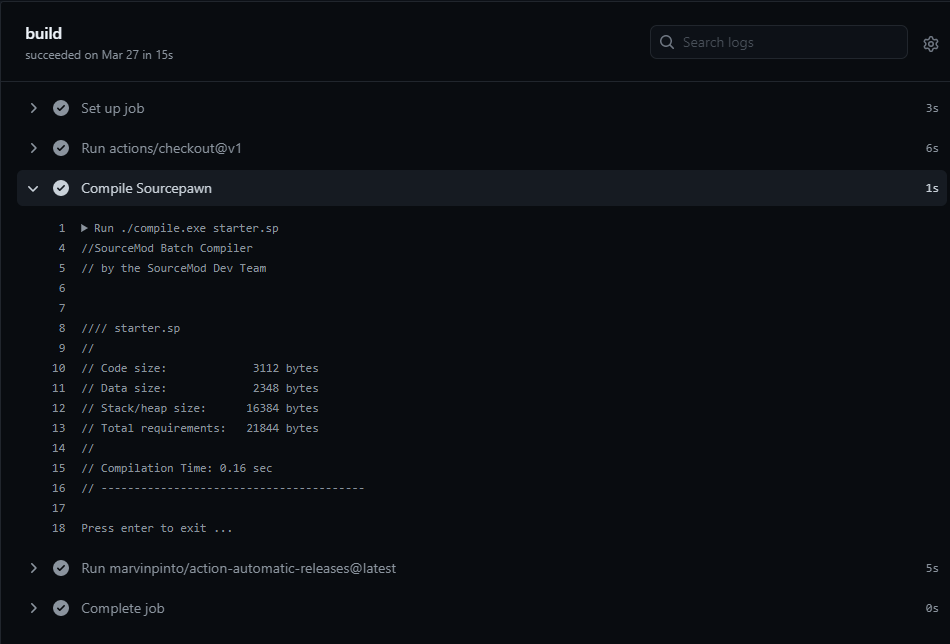
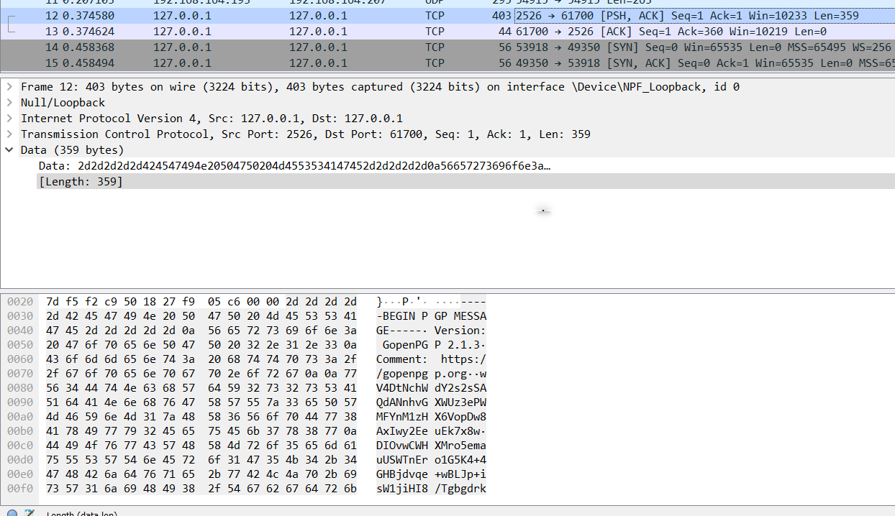

portfolio.txt

## Source VTF format modifier

When you are put on board with a new team, you get the pleasure of fixing what the people before you did. I ran into an interesting scenario where I had hundreds of VTF materials for models on a Source Engine game, but these files were using the DXT3 compression format over the DXT5 compression format, making the filesize 3x the size it should be. The images did not store any transparency so the higher bit format was unnecessary.

To speed this process up I added a queue system as the program needed to spawn multiple child proccesses after another so it was important to do these in a controlled manner, 5 files at a time, three subproccesses at once for each file. To maintain good preformance I split these into different gothreads and limited cpu usage to around 85% so it didnt max out your entire computer on all cores and bring it to its knees. (The actual reason why i did this is so my old laptop wouldnt shutdown automatically from drawing too much current from the cpu... lol.)

## Sourcepawn CI/CD Enviornment

Having good DevOps makes developing for communitys and companies many times easier for the developers and allows increased collaboration and productivity, which is why I spent the agregious task of setting it up for my community. Using github actions, I compile each new versions of my plugin on each commit and automatically deploy the compiled plugin to my ftp server. Through bash scripts the server can automatically detect new plugin changes and reload the plugins to have seamless code to product synergy.

When a commit is stable enough for release, merging it to the master branch will run the CI/CD Github Actions and will be created as a release, the live production server will pull the release automatically and deploy it with a live reload to have no downtime on the server with players currently playing on it.

## Sourcepawn "Jihad" for Counter Strike: Source Jailbreak

When searching around for a good jihad plugin for our jailbreak server, there was existing ones but they lacked in quality or the features we wanted. I created a random chance selecter for the Prisoners to "choose" to "make" a bomb. This differed greatly from the existing jihads plugins where it would either wait till you have $16000 cash (and all the T's had this at the same time so they would have 8 Rounds with a Jihad in a row, annoying.) or they would not randomly select a person to get a jihad, and you would have to spam a console command at round start to get the jihad before someone else. The way it works now is that there is a console variable for a random chance of having a jihad in the round, default being 1 in 3 chance, and then once it is a "jihad round", you would be randomly selected the option to "make" a bomb.



## Sourcepawn CS:GO Playermodels for Counter Strike: Source

My community leader wanted us to have the CS:GO playermodels for our casual 16v16 server. The existing solutions for this involved a clunky menu where you had to open using an ugly command, which lead to people going "how do i get that model" or "whats the command to get custom models" and felt like a very hacky way to do it. I ended up doing a solution where the playermodel you spawn with is directly correlated to the playermodel you select on the team select screen. This way the model selection is baked in and FORCED before you even join a team and spawn.



## Unity Game Development

With the collaboration with friends, I created a sumo wrestling car game, combined with fun powerups and realtime networked multiplayer. For the record, I never want to work with networking and unity again. I cried real tears after it worked properly for the first time. It is still of course, buggy, but its in a good state to where we could satisfyingly leave it and move onto a better project after learning that through the prototype it had no future due to the nature of cars. We could switch out the realistic cars for a more arcadey one but it would require a lot of work and rewriting code that we really didnt want to do after the massive hill we overcame just to have at this point. Having the ability to ragequit any project is very important to me.



I also dabbled with a simple infinite scroller type game that would ideally be used on a phone. The controls are very simple so creating a mobile game was as simple as designating the left side of the screen to `left` and the right half of the screen to be `right`. The game consists of a simple concept where you dodge an endless stream of blocks and collect coins that are saved when you leave the game and come back to it. I created an entire storefront for the game but eventually lost interest as it would not be published anywhere other than my own learning. 

You can play the game [here](https://play.unity.com/mg/other/testmobilegame-1)



## GoLang P2P Encrypted RAT

In search of my quest to fuck with the computers school infrastructure, I started to research viruses and ways to break group policy and antiviruses. This lead me down a path of finding a new and loved language, GoLang, and I used it for all future projects due to ease and powerful features that I could not find in other languages or they lacked a good implementation of it. Being able to compile down to a binary is an essential feature for some projects as having to install a 500mb runtime just to start the program is more annoying than you would think.

Working on the P2P encryption was quite a task as sending packets is not so simple and especially when you want to introduce encryption into it. Originally I sent plain text through tcp sockets but eventually switched to https websockets as they are significantly easier to disguise and do not flag firewalls or antiviruses. The port 80 is almost always open on all systems and networks. I used gopenpgp from ProtonMail to encrypt my messages and it abstracted a lot of the hard and complicated parts about encryption.

Here you can see me executing `msg fuckingretard hi` on my server, encrypting it then sending it to my client to finally decrypt it and run the command. Below you can see wireshark picking up the packets and seeing the openpgp message rather than its unencrypted counterpart.

## Raspberry Pi Nightvision Camera

I want to preface this by saying I'm not a [creep,](https://www.youtube.com/watch?v=XFkzRNyygfk) but I have always been fascinated by watching the world happen, in the past. I love watching the wildlife on my yard, the animals that come and raid my garden at night, and the bears scavaging for berries from my bushes. I decided to kill two birds with one stone by setting up a survelience system on my house with a few Raspberry Pi's with nightvision cameras. 

With my setup, I have one node server, a Debian Server box, and two Raspberry Pi's, (3b+ and a 4,4gb) one for my front yard + driveway and one for my backyard. A significant task was learning that nightvision does not work well with high framerates! Shutter speed, limited by framerate affects the amount of light that a camera can take in and when you have nightvision, the amount of infrared light bouncing into the camera affects the ability to see at night greatly, as the world isnt lit up by a giant sun, but but a small infrared spotlight illuminator.

To remedy this, I created a small program using GoLang and a really complicated formula that I dont understand fully to get the phases of the day to swap out configuration files for MotionEye on the fly with a small downtime of 2 seconds. Unfortunately this is not the idea fix to the problem but its the best of a bad situation because to change the camera settings during recording you must relaunch the executable with new flags. I could potentially fix the issue myself and recompile the entire program myself but this is yet another rabbithole to go down.
 

I designed a cad model of the raspberry pi, and then a case around it to protect from the elements and also a mounting bracket for my house. This case is not waterproof or weatherproof for that matter but will protect it from most rain and bird shit that falls from the sky.

# Outside the house

MotionEye is a great tool and is by far the best survellience system suite that I have found as all the others are either ancient and old or not compatible with linux.

I set up a service on the Debian Server box to automatically send me push notifications on motion detection, and upload a snapshot of the past 30 seconds to cloud storage, Google Drive. There is a persistance time that works and automatically deletes files after a set time from Google Drive and my local disk. I hope to setup a timelapse of my house throughout the years which would be pretty interesting to see it evolve and wildlife grow over time.

## bonus: cool robot with flamethrower 😎

